# Keyboard Quantizer Mini (キット版)　ビルドガイド

## 必要なもの

* はんだごて、はんだ
* ラジオペンチ

## キットに入っているもの

* 基板
* USBコネクタ（オス・メス）
* ケース

## 組み立て手順

### ハンダ付け

* 基板にタブがついている場合は折る
  |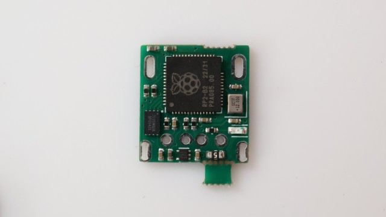|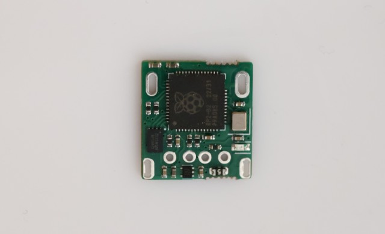|
  |-|-|
* USBコネクタ（オス）を基板に差し込む
  * 基板から浮かないように奥までしっかり押し込んでください

  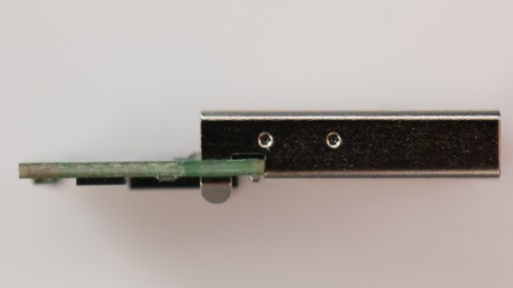
* USBコネクタ（オス）をハンダ付けする

  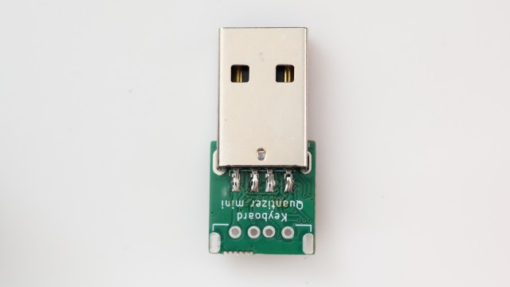
* USBコネクタ（オス）のタブ部分をラジオペンチで軽く折り曲げる
  |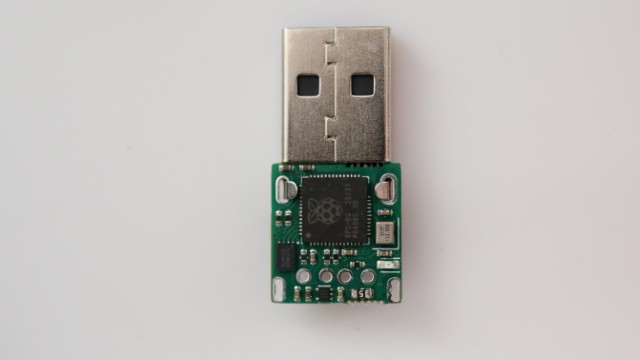|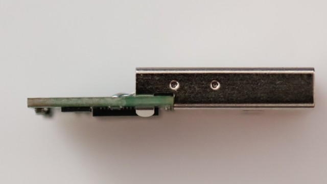|
  |-|-|
* USBコネクタ（メス）を基板に差し込む
  * 基板から浮かないように奥までしっかり押し込んでください
* USBコネクタ（メス）をハンダ付けする
  * ハンダを盛りすぎてほかの部分とショートしないように気を付けてください
* USBコネクタ（オス）のタブ部分をハンダ付けする
  * USBコネクタ全体が熱くなるので火傷しないように注意してください
  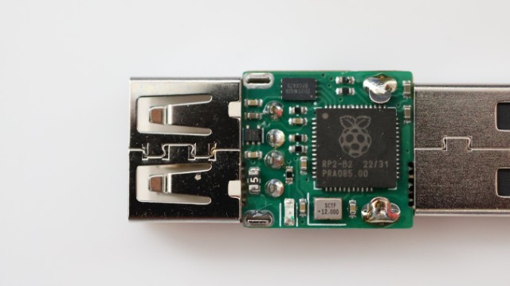
* USBコネクタ（オス）が冷めるのを待つ

### 動作確認

* Keyboard Quantizerにキーボードを接続する
* Keyboard QuantizerをPCに差し込む
* RPI-RP2ドライブが表示されたら[vial用ファームウェアのUF2ファイル](https://github.com/sekigon-gonnoc/keyboard-quantizer-doc/releases/download/mini-6/sekigon_keyboard_quantizer_mini_vial.uf2)を書き込む
* Keyboard Quantizer MiniのLEDが点灯するのを待つ
  * 初回書き込みは起動まで数十秒、そこからキー入力を認識できるようになるまで10秒くらいかかります
* キーボードからキー入力できることを確認する

### ケースの取り付け

* Keyboard Quantizerのオスコネクタ側からケースに差し込む
 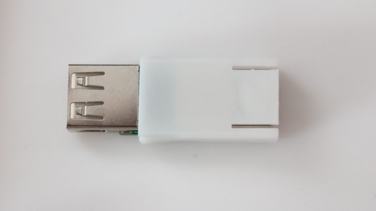
* ケースのタブとオスコネクタを持ち上げながらさらに押し込む
  * メスコネクタとケースが引っかかる場合があります。その場合はメスコネクタ側のケースを軽く持ち上げながら押し込んでください

 |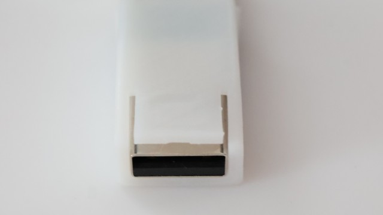|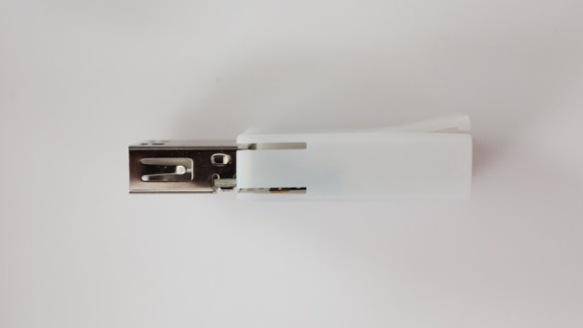|
 |-|-|
 |押し込んでいる途中をオス側から見た図|押し込んでいる途中を横から見た図（右がオス側）|

 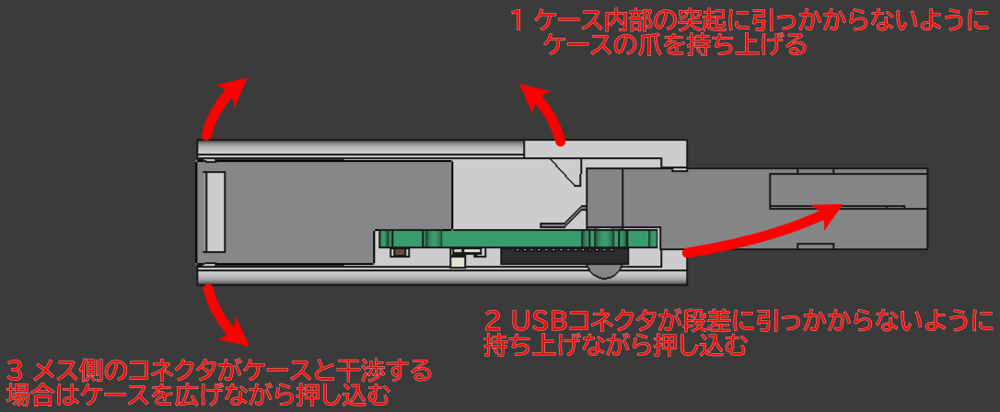
